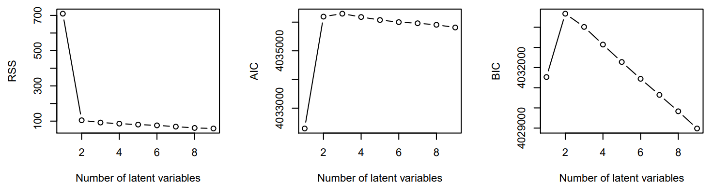
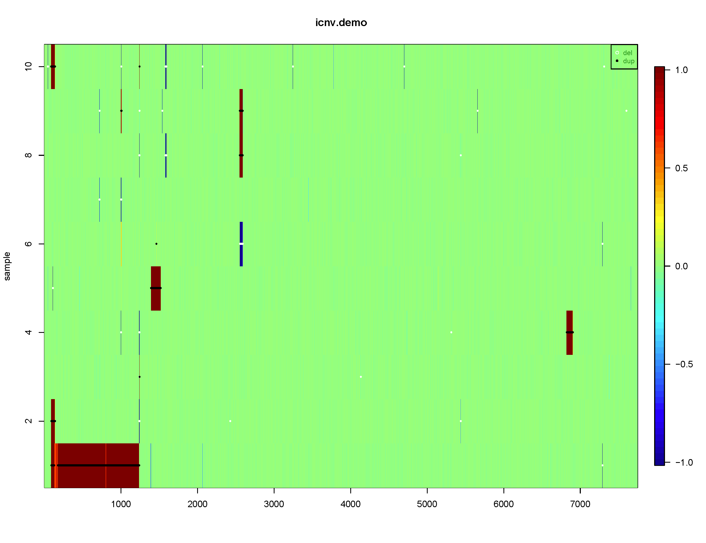

# iCNV Vignette

## Author
Zilu Zhou, Nancy R. Zhang

## Maintainer
Zilu Zhou <zhouzilu@pennmedicine.upenn.edu>

## Date
12/11/2017

  This is a demo for using the **iCNV** package in R. **iCNV** is a normalization and copy number variation detection procedure for mutiple study designs: WES only, WGS only, SNP array only, or any combination of SNP and sequencing data. **iCNV** applies platform specific normalization, utilizes allele specific reads from sequencing and integrates matched NGS and SNP-array data by a Hidden Markov Model (HMM). Figure below shows the overall pipeline. This package specifically emphasizes on the steps within the red box. Below is an example on calling copy number variation using whole-exome sequencing data and array SNPs of 10 modified samples from Alzheimer's Disease Sequencing Project. Only small portion of chromesome 22 are analysed for illustration purposes. We will seperately shows normalization for WES and SNP array. We will also introduce integrated calling procedure as well as single platform procedure. Demo dataset see https://github.com/zhouzilu/iCNV/tree/master/demo.zip

```
                    NGS                                                 |               Array
       BAM              BED(UCSC for WES or bed_generator.R for WGS 2.2)|        SNP Intensity(in standard format)
        |----------------|                                              |             |
        |                |                                              |             |icnv_array_input.R (2.4)
        |SAMTools(2.3)   |CODEX(2.2)                                    |             |
        |                |                                              |             |-----------|
Variants BAF(vcf)       PLR                                             |        Array LRR   Array BAF
        |                |                                              |             |           |
        |                |                                              |             |SVD(2.4)   |
        |                |                                              |             |           |
        |                |                                              |     Normalized LRR      |
        |                |                                              |             |           |
        -------------------------------------------------------------------------------------------
                                                        |
                                                        |iCNV_detection
                                                        |
                                                   CNV calling
```


  We strongly recommend to combine platform when both WES data and SNP array are available. However, for high quality  WGS data, SNP information isn't so necessary.

## 1. Website and online forum

iCNV's website with usage and installation information: https://github.com/zhouzilu/iCNV 

## 2. iCNV workflow
We could seperate the basic iCNV workflow into 5 steps: **1.** package installation; **2.** .bam file normalization; **3.** sequence variants BAF calling; **4.** SNP array LRR normalization and BAF; **5.** CNV detection using `iCNV_detection` function. **6.** CNV detection using `iCNV_detection` function with single platform. We will illustrate them one by one in the following sessions. Try out with the Demo code and sample dataset in https://github.com/zhouzilu/iCNV/tree/master/demo

### 2.1 Install iCNV.

Install `CODEX` first
```r
## try http:// if https:// URLs are not supported
source("https://bioconductor.org/biocLite.R")
biocLite("CODEX")
```
Install the current release from Github:
```r
install.packages("devtools")
library(devtools)
install_github("zhouzilu/iCNV/package")
```

### 2.2 .bam file normalization using CODEX
For researchers work on WGS data, you need to generate your own BED file for CODEX normalization. We made a function [bed_generator](https://github.com/zhouzilu/iCNV/blob/master/iCNV_rdoc.pdf) to help you with this.

After you have BAM file and BED file available, follow code below to get normalized NGS PLR. Code modified from https://github.com/yuchaojiang/CODEX with permission. Due to the file upload size restriction, raw demo BAM file isn't uploaded to Github. Please email zhouzilu@pennmedicine.upenn.edu to request BAM data.
```r
###################################################
### 2.2 code chunk number 1: bambedObj1
###################################################
library(CODEX)
# Assume your work dir set to demo
dirPath <- 'demo/ngs/bam'# 'PATH/TO/BAM'
bamFile <- list.files(dirPath, pattern = '*.bam$')
bamdir <- file.path(dirPath, bamFile)
sampname <- as.matrix(read.table(file.path(dirPath, "sampname")))
bedFile <- file.path(dirPath, "chr22_18000_to_38000.bed")
chr <- 22
bambedObj <- getbambed(bamdir = bamdir, bedFile = bedFile, 
                   sampname = sampname, projectname = "icnv.demo", chr)
bamdir <- bambedObj$bamdir; sampname <- bambedObj$sampname
ref <- bambedObj$ref; projectname <- bambedObj$projectname; chr <- bambedObj$chr
###################################################
### 2.2 code chunk number 2: coverageObj1
###################################################
coverageObj <- getcoverage(bambedObj, mapqthres = 20)
Y <- coverageObj$Y; readlength <- coverageObj$readlength
###################################################
### 2.2 code chunk number 3: gcmapp1
###################################################
gc <- getgc(chr, ref)
mapp <- getmapp(chr, ref)
###################################################
### 2.2 code chunk number 4: qcObj1
###################################################
qcObj <- qc(Y, sampname, chr, ref, mapp, gc, cov_thresh = c(20, 4000), 
            length_thresh = c(20, 2000), mapp_thresh = 0.9, gc_thresh = c(20, 80))
Y_qc <- qcObj$Y_qc; sampname_qc <- qcObj$sampname_qc; gc_qc <- qcObj$gc_qc
mapp_qc <- qcObj$mapp_qc; ref_qc <- qcObj$ref_qc; qcmat <- qcObj$qcmat
###################################################
### 2.2 code chunk number 5: normObj1
###################################################
normObj <- normalize(Y_qc, gc_qc, K = 1:9)
Yhat <- normObj$Yhat; AIC <- normObj$AIC; BIC <- normObj$BIC
RSS <- normObj$RSS; K <- normObj$K
choiceofK(AIC, BIC, RSS, K, filename = paste0(projectname, "_", chr, "_choiceofK.pdf"))
save(qcObj,normObj,sampname,file=paste0(projectname,"_",chr,".rda") )
```
CODEX reports all three statistical metrics (AIC, BIC, percent of Variance explained) and uses BIC as the
default method to determine the number of Poisson factors. Since false positives can be screened out through
a closer examination of the post-segmentation data, whereas CNV signals removed in the normalization step
cannot be recovered, CODEX opts for a more conservative normalization that, when in doubt, uses a smaller
value of K. For example,

Here we pick `optK=2`
```r
load(paste0(projectname,"_",chr,".rda"))
optK = K[which.max(BIC)] # by default or customize given curves
###################################################
### 2.2 code chunk number 6: plr
###################################################
Y_qc <- qcObj$Y_qc; sampname_qc <- qcObj$sampname_qc; gc_qc <- qcObj$gc_qc
mapp_qc <- qcObj$mapp_qc; ref_qc <- qcObj$ref_qc; qcmat <- qcObj$qcmat
Yhat <- normObj$Yhat; AIC <- normObj$AIC; BIC <- normObj$BIC
RSS <- normObj$RSS; K <- normObj$K
ref_qc=qcObj$ref_qc # IRanges object for exon target
sampname_qc=qcObj$sampname_qc # sample names
Y_norm=normObj$Yhat[[optK]] # normalized read count under null (no CNV)
plr=log(pmax(Y_qc,0.0001)/pmax(Y_norm,0.0001)) # log transformed z-scores
ngs_plr=lapply(seq_len(ncol(plr)), function(i) plr[,i])
ngs_plr.pos=lapply(seq_len(ncol(plr)),function(x){return(cbind(start(ref_qc),end(ref_qc)))})
save(sampname_qc,ngs_plr,ngs_plr.pos,file=paste0(projectname,'plrObj_',chr,'_',optK,'.rda'))
```
For detailed illustration of CODEX, please visit https://github.com/yuchaojiang/CODEX

### 2.3 sequence variants BAF calling

For sequencing data without sophisticated pipeline and SNVs call set in VCF format, we manually call SNVs from quality controlled BAM files by mpileup module in samtools, and calculate B allele frequency(BAF) on heterogeneous loci by dividing DV (Number of high-quality non-reference bases, FORMAT) from DP (Number of high-quality bases, FORMAT). Example code are:
```
# Prerequest: samtools, bcftools and reference fasta file
cd PATH/TO/BAM
for i in *bam; do PATH/TO/SAMTOOLS/samtools mpileup -ugI -t DP -t DV -f PATH/TO/REF/human_hg37.fasta $i | ~/bcftools-1.3.1/bcftools call -cv -O z -o PATH/TO/OUTPUT/$i.vcf.gz; done
```

We could further extract variants BAF info from vcf file by function [bambaf_from_vcf](https://github.com/zhouzilu/iCNV/blob/master/iCNV_rdoc.pdf). 
```r
library(iCNV)
projectname = "icnv.demo"
dir='ngs/baf' # PATH/TO/FOLDER
bambaf_from_vcf(dir,'vcf.sample.list',chr=22,projectname) # ignore chr argement if want to convert all chromosome 1-22
load(file.path(dir,'bambaf_22.rda'))
str(ngs_baf)
str(ngs_baf.pos)
```

### 2.4 SNP array LRR normalization and BAF
Due to the fact that signal intensity files varies from platform, we set a standard signal intensity file format for each individual. For example 
```
Name,Chr,POS,sample_1.Log R Ratio,sample_1.B Allele Freq
rs1,22,15462739,-0.096390619874,0.0443964861333
rs2,22,15520991,-0.154103130102,0.963218688965
rs3,22,15780940,-0.110297381878,0.0457459762692
rs4,22,15863717,-0.21270519495,0.957377910614
rs5,22,16532045,-0.0330782271922,0.0300635993481
```
First row is the rsid (Name), followed by chromosome (Chr) and position (POS), then the log R ratio (sample1.Log R Ratio) and BAF (sample1.B Allele Freq). We could use function [get_array_input](https://github.com/zhouzilu/iCNV/blob/master/iCNV_rdoc.pdf) to convert into iCNV input. For example, in demo:
```r
###################################################
### 2.4 code chunk number 1: icnv_array_input
###################################################
library(iCNV)
dir='array' # PATH/TO/FOLDER
projectname = "icnv.demo"
pattern=paste0('*.csv.arrayicnv$')
get_array_intput(dir,pattern,chr=22,projectname=projectname)
load(file.path(dir,paste0(projectname,'array_lrrbaf_22.rda')))
str(snp_lrr)
str(snp_lrr.pos)
str(snp_baf)
str(snp_baf.pos)
```

For some of the SNP array LRR data, we need to apply SVD normalization to remove high dimension noisy and preserve low dimension signal. The best way to decide data senity is by plotting out the data by `plot_intensity` function. Noisy data has the feature of local strip across samples. Conventional way for identifying elbow points can also apply here. Example code for remove high dimension noisy and plot:

```r
###################################################
### 2.4 code chunk number 2: svd (optional)
###################################################
library(iCNV)
dir='array' # PATH/TO/FOLDER
pattern=paste0('*.csv.arrayicnv$')
load(file.path(dir,'get_array_input_22.rda'))
# standardize LRR
lrr.sd = mapply(function(x){x=pmax(pmin(x,100),-100);(x-mean(x,na.rm=T))/sd(x,na.rm = T)},snp_lrr,SIMPLIFY = T)
# You may want to substitute all the NAs in lrr by rowMeans
lrr.sd.dena = apply(lrr.sd,2,function(x){x[is.na(x)]=mean(x,na.rm=T);return(x)})

# lrr is LRR matrix, with row as sample and column as positions
lrr.svd = svd (t(lrr.sd.dena))
save(lrr.svd,file=paste0(projectname,'array_lrrbaf_svd_',chr,'.rda'))

# Plot out the variance explained with K
pdf(paste0(projectname,'array_lrrbaf_svd_',chr,'.pdf'),height=8,width=10)
plot(x=seq(1,10,1),y=(lrr.svd$d[1:10])^2/sum(lrr.svd$d^2),xlab='rank',ylab='D square',main='Variance explained',type='l')
dev.off()
```

There is no universal rule of picking the optK. Usually we prefer those "elbow points". For example,

We pick `optK=5`
```r
###################################################
### 2.4 code chunk number 3: normalization (optional)
###################################################
library(iCNV)
optK = 5
D=diag(lrr.svd$d)
D.lowrank=diag(c(rep(0,optK),lrr.svd$d[-(seq(1,optK,1))]))
lrr.denoise=t(lrr.svd$u %*% D.lowrank %*% t(lrr.svd$v))
snp_lrr = lapply(seq_len(ncol(lrr.denoise)), function(i) lrr.denoise[,i])
save(snp_lrr,snp_baf,snp_lrr.pos,snp_baf.pos, file=file.path(dirPath,paste0(projectname,'array_lrrbaf_',chr,'_svded.rda')))
```

### 2.5 Mutiple platform CNV detection using **iCNV**

At this step, we should alreday have PLR and variants BAF from sequencing, normalized LRR and BAF from SNP array. Please make sure all the input are in list form. This is mainly to accomadate the fact that length for `ngs_baf` and `ngs_baf.pos` is sample specific
Try out with the Demo code and sample dataset in https://github.com/zhouzilu/iCNV/tree/master/demo.zip
```r
library(iCNV)
# load array data
dir='array' # PATH/TO/ARRAYDATA
load(file.path(dir,paste0(projectname,'array_lrrbaf_22.rda')))
# If svd, load(file.path(dirPath,paste0(projectname,'array_lrrbaf_22_svded.rda')))) instead

# load NGS PLR
load(file.path('ngs',paste0(projectname,'plrObj_22_2.rda')))

# load NGS BAF
dir='ngs/baf' # PATH/TO/NGSBAF
load(file.path(dir,paste0(projectname,'bambaf_22.rda')))

ls()
str(ngs_plr) # List of n vector, each one is the PLR for an exon
str(ngs_plr.pos) # List of n matrix (p x 2), each one is the start and end location for an exon
str(ngs_baf) # List of n vector, each one is the variants BAF from .bam
str(ngs_baf.pos) # List of n vector, each one is the variants BAF position
str(snp_lrr) # List of n vector, each one is the normalized LRR for a SNP
str(snp_lrr.pos) # List of n vector, each one is a SNP position
str(snp_baf) # List of n vector, each one is the BAF for a SNP
str(snp_baf.pos) # List of n vector, each one is the SNP BAF position
projname='icnv.demo'
icnv_res0=iCNV_detection(ngs_plr,snp_lrr,
                         ngs_baf,snp_baf,
                         ngs_plr.pos,snp_lrr.pos,
                         ngs_baf.pos,snp_baf.pos,
                         projname=projname,CN=0,mu=c(-3,0,2),cap=T,visual = 1)
icnv.output = output_list(icnv_res0,sampname_qc,CN=0)
head(icnv.output)
```
The results plot looks are follow. Each row is a sample and each column is a hidden state. The color indicates hidden state Z-score (large positive number prefers amplification, low negative number prefers deletion). Black dots represent amplification detected, while white dots show deletion detected.



We could further convert icnv.output to Genome Browser input file:
```r
icnv.output = output_list(icnv_res=icnv_res0,sampleid=sampname_qc, CN=0, min_size=10000)
gb_input = icnv_output_to_gb(22,icnv.output)
write.table(gb_input,file='icnv_res_gb_chr22.tab',quote=F,col.names=F,row.names=F)
```

The color code for CNV in Genome Browser is:


This is different from the color code for us plotting the data. We are just try to make it concordinate with IGV notation.

We could also plot information in a single individual using function `plotindi`. Example shows below:
```r
plotindi(ngs_plr,snp_lrr,
         ngs_baf,snp_baf,
         ngs_plr.pos,snp_lrr.pos,
         ngs_baf.pos,snp_baf.pos,
         icnv_res0,1)
```

### 2.6 Single platform CNV detection using **iCNV** 

At this step, we should alreday have PLR and variants BAF from sequencing OR normalized LRR and BAF from SNP array. Please make sure all the input are in list form. 
Try out with the Demo code and sample dataset in https://github.com/zhouzilu/iCNV/tree/master/demo
NGS only CNV detection using **iCNV** 
```r
library(iCNV)
load('demo_data.rda')
ls()
str(ngs_plr) # List of n vector, each one is the PLR for an exon
str(ngs_plr.pos) # List of n matrix (p x 2), each one is the start and end location for an exon
str(ngs_baf) # List of n vector, each one is the variants BAF from .bam
str(ngs_baf.pos) # List of n vector, each one is the variants BAF position
projname='icnv.demo.ngs'
icnv_res0_ngs=iCNV_detection(ngs_plr=ngs_plr, ngs_baf = ngs_baf, ngs_plr.pos = ngs_plr.pos,ngs_baf.pos = ngs_baf.pos, projname=projname,CN=0,mu=c(-3,0,2),cap=T,visual = 2)
icnv.output = output_list(icnv_res0,sampname_qc,CN=0)
head(icnv.output)
```


SNP array only CNV detection using **iCNV** 
```r
library(iCNV)
load('demo_data.rda')
ls()
str(snp_lrr) # List of n vector, each one is the normalized LRR for a SNP
str(snp_lrr.pos) # List of n vector, each one is a SNP position
str(snp_baf) # List of n vector, each one is the BAF for a SNP
str(snp_baf.pos) # List of n vector, each one is the SNP BAF position
projname='icnv.demo.snp'
icnv_res0_snp=iCNV_detection(snp_lrr=snp_lrr, snp_baf = snp_baf, snp_lrr.pos = snp_lrr.pos,snp_baf.pos = snp_baf.pos, projname=projname,CN=0,mu=c(-3,0,2),cap=T,visual = 2)
icnv.output = output_list(icnv_res0,sampname_qc,CN=0)
head(icnv.output)
```

