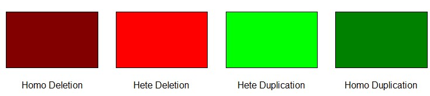

---
output:
  html_document: default
  pdf_document: default
---

# iCNV Vignette

## Author
Zilu Zhou, Nancy R. Zhang

## Maintainer
Zilu Zhou <zhouzilu@pennmedicine.upenn.edu>

## Date
01/22/2017

  This is a demo for using the **iCNV** package in R. **iCNV** is a normalization and copy number variation detection procedure for mutiple study designs: WES only, WGS only, SNP array only, or any combination of SNP and sequencing data. **iCNV** applies platform specific normalization, utilizes allele specific reads from sequencing and integrates matched NGS and SNP-array data by a Hidden Markov Model (HMM). Figure below shows the overall pipeline. This package specifically emphasizes on the steps within the red box. Below is an example on calling copy number variation using whole-exome sequencing data and array SNPs of 46 modified samples from 1000 Genome Project. Only small portion of chromesome 22 are analysed for illustration purposes. We will seperately shows normalization for WES and SNP array. We will also introduce integrated calling procedure as well as single platform procedure. 

```
              NGS                                             |         Array
 BAM        BED(UCSC for WES or bed_generator.R for WGS 2.2)  |  SNP Intensity(in standard format)
  |----------------|                                          |           |
  |                |                                          |           |icnv_array_input(2.4)
  |SAMTools(2.3)   |CODEX(2.2)                                |           |
  |                |                                          |           |-----------|
Variants BAF(vcf) PLR                                         |      Array LRR   Array BAF
  |                |                                          |           |           |
  |                |                                          |           |SVD(2.4)   |
  |                |                                          |           |           |
  |                |                                          |   Normalized LRR      |
  |                |                                          |           |           |
  -------------------------------------------------------------------------------------
                                                  |
                                                  |iCNV_detection
                                                  |
                                             CNV calling
                                                  |
                                                  |icnv_output_to_gb
                                                  |
                                            Genome Browser file
```

  We strongly recommend to combine platform when both WES data and SNP array are available. However, for high quality  WGS data, SNP information isn't so necessary.

## 1. Website and online forum

  iCNV's website with usage and installation information: https://github.com/zhouzilu/iCNV 

## 2. iCNV workflow
  We could seperate the basic iCNV workflow into 6 sections: **1.** package installation; **2.** .bam file normalization; **3.** sequence variants BAF calling; **4.** SNP array LRR normalization and BAF; **5.** CNV detection using `iCNV_detection` function. **6.** CNV detection using `iCNV_detection` function with single platform. We will illustrate them one by one in the following sessions.

### 2.1 Install iCNV.

  Install `CODEX` first

```r
## try http:// if https:// URLs are not supported
source("https://bioconductor.org/biocLite.R")
biocLite("CODEX")
```

  Install the current release from Github:

```r
install.packages("devtools")
library(devtools)
install_github("zhouzilu/iCNV")
```

### 2.2 .bam file normalization using CODEX
  For researchers work on WGS data, you need to generate your own BED file for CODEX normalization. We made a function [bed_generator](https://github.com/zhouzilu/iCNV/blob/master/iCNV_rdoc.pdf) to help you with this.

  After you have BAM file and BED file available, follow code below to get normalized NGS PLR. Code modified from https://github.com/yuchaojiang/CODEX with permission. If you have any addtional question, please refer to `CODEX`. iCNV only adopt normalized Possion Likelihood Ratio from `CODEX`, representing NGS 'intensity'. In this example, we utilize toy data from the 1000 Genomes Project for illustration.

```{r message=FALSE,results='hide',fig.keep='all',fig.height=2, fig.width=8}
###################################################
### 2.2 code chunk number 1: bambedObj1
###################################################
library(CODEX)
library(WES.1KG.WUGSC) # Load Toy data from the 1000 Genomes Project.
library(iCNV) 
# Assume your work dir set to demo
dir <- system.file("extdata", package = "WES.1KG.WUGSC") # 'PATH/TO/BAM'
bamFile <- list.files(dir, pattern = '*.bam$')
bamdir <- file.path(dir, bamFile)
sampname <- as.matrix(read.table(file.path(dir, "sampname")))
bedFile <- file.path(dir, "chr22_400_to_500.bed")
chr <- 22
bambedObj <- getbambed(bamdir = bamdir, bedFile = bedFile, 
                   sampname = sampname, projectname = "icnv.demo.", chr)
bamdir <- bambedObj$bamdir; sampname <- bambedObj$sampname
ref <- bambedObj$ref; projectname <- bambedObj$projectname; chr <- bambedObj$chr
###################################################
### 2.2 code chunk number 2: coverageObj1
###################################################
coverageObj <- getcoverage(bambedObj, mapqthres = 20)
Y <- coverageObj$Y; readlength <- coverageObj$readlength
###################################################
### 2.2 code chunk number 3: gcmapp1
###################################################
gc <- getgc(chr, ref)
mapp <- getmapp(chr, ref)
###################################################
### 2.2 code chunk number 4: qcObj1
###################################################
qcObj <- qc(Y, sampname, chr, ref, mapp, gc, cov_thresh = c(20, 4000), 
            length_thresh = c(20, 2000), mapp_thresh = 0.9, gc_thresh = c(20, 80))
Y_qc <- qcObj$Y_qc; sampname_qc <- qcObj$sampname_qc; gc_qc <- qcObj$gc_qc
mapp_qc <- qcObj$mapp_qc; ref_qc <- qcObj$ref_qc; qcmat <- qcObj$qcmat
###################################################
### 2.2 code chunk number 5: normObj1
###################################################
normObj <- normalize(Y_qc, gc_qc, K = 1:9)
Yhat <- normObj$Yhat; AIC <- normObj$AIC; BIC <- normObj$BIC
RSS <- normObj$RSS; K <- normObj$K
choiceofK(AIC, BIC, RSS, K, filename = paste0(projectname, chr, "_choiceofK.pdf"))
save(qcObj,normObj,sampname,file=paste0(projectname,'plrObj_', chr,".rda"))
# This saving step is necessary for large dataset, such that you don't need 
# to recompute everything again if you would like to view your choice of K 
# plot. You could just load this as in the next chunk of code.
```

  CODEX reports all three statistical metrics (AIC, BIC, percent of Variance explained) and uses BIC as the
  default method to determine the number of latent Poisson factors. Since false positives can be screened out through
  a closer examination of the post-segmentation data, whereas CNV signals removed in the normalization step
  cannot be recovered, CODEX opts for a more conservative normalization that, when in doubt, uses a smaller
  value of K. For example,

```{r ,fig.height=2, fig.width=8, include=F}
Kmax <- length(AIC)
par(mfrow = c(1, 3))
plot(K, RSS, type = "b", xlab = "Number of latent variables")
plot(K, AIC, type = "b", xlab = "Number of latent variables")
plot(K, BIC, type = "b", xlab = "Number of latent variables")
```

  Here we pick `optK=2`

```{r message=FALSE}
load(paste0(projectname,'plrObj_',chr,".rda"))
optK = K[which.max(BIC)] # by default or customize given curves
###################################################
### 2.2 code chunk number 6: plr
###################################################
Y_qc <- qcObj$Y_qc; sampname_qc <- qcObj$sampname_qc; gc_qc <- qcObj$gc_qc
mapp_qc <- qcObj$mapp_qc; ref_qc <- qcObj$ref_qc; qcmat <- qcObj$qcmat
Yhat <- normObj$Yhat; AIC <- normObj$AIC; BIC <- normObj$BIC
RSS <- normObj$RSS; K <- normObj$K
ref_qc=qcObj$ref_qc # IRanges object for exon target
sampname_qc=qcObj$sampname_qc # sample names
Y_norm=normObj$Yhat[[optK]] # normalized read count under null (no CNV)
plr=log(pmax(Y_qc,0.0001)/pmax(Y_norm,0.0001)) # log transformed z-scores
ngs_plr=lapply(seq_len(ncol(plr)), function(i) plr[,i])
ngs_plr.pos=lapply(seq_len(ncol(plr)),function(x){return(cbind(start(ref_qc),end(ref_qc)))})
save(sampname_qc,ngs_plr,ngs_plr.pos,file=paste0(projectname,'plrObj_',chr,'_',optK,'.rda'))
```

  For detailed illustration of CODEX, please visit https://github.com/yuchaojiang/CODEX

### 2.3 sequence variants BAF calling

  For sequencing data without sophisticated pipeline and SNVs call set in VCF format, we manually call SNVs from quality controlled BAM files by mpileup module in samtools, and calculate B allele frequency(BAF) on heterogeneous loci by dividing AD (Number of high-quality non-reference bases, FORMAT) from DP (Number of high-quality bases, FORMAT). Example code are:

```{r, engine = 'bash', eval = FALSE}
# Prerequest: samtools, bcftools and reference fasta file
cd PATH/TO/BAM
for i in *bam; do PATH/TO/SAMTOOLS/samtools mpileup -ugI -t AD -t DP -f 
  PATH/TO/REF/human_hg37.fasta $i | PATH/TO/BAFTOOLS/bcftools 
  call -cv -O z -o PATH/TO/OUTPUT/$i.vcf.gz; done
# The reference genome depends on your BAM built
for i in *gz; do PATH/TO/BAFTOOLS/bcftools view -g het -i 'FORMAT/DP>10' -O z -o $i.filter $i; done
```

  We could further extract variants BAF info from vcf file by function [bambaf_from_vcf](https://github.com/zhouzilu/iCNV/blob/master/iCNV_rdoc.pdf). 

```{r message=FALSE,results='hide'}
###################################################
### 2.3 code chunk number 1: bambaf_from_vcf
###################################################
projectname = "icnv.demo."
dir <- system.file("extdata", package="iCNV")
bambaf_from_vcf(dir,'bam_vcf.list',chr=22,projectname) 
# ignore chr argement if you want to convert all chromosome 1-22
load(paste0(projectname,'bambaf_22.rda'))
```

### 2.4 SNP array LRR normalization and BAF
  Due to the fact that signal intensity files varies from platform, we set a standard signal intensity file format for each individual. The format looks as follow:

```
Name,Chr,POS,sample_1.Log R Ratio,sample_1.B Allele Freq
rs1,22,15462739,-0.096390619874,0.0443964861333
rs2,22,15520991,-0.154103130102,0.963218688965
rs3,22,15780940,-0.110297381878,0.0457459762692
rs4,22,15863717,-0.21270519495,0.957377910614
rs5,22,16532045,-0.0330782271922,0.0300635993481
```
  
  First row is the rsid (Name), followed by chromosome (Chr) and position (POS), then the log R ratio (sample1.Log R Ratio) and BAF (sample1.B Allele Freq). We could use function [get_array_input](https://github.com/zhouzilu/iCNV/blob/master/iCNV_rdoc.pdf) to convert into iCNV input. For example, in demo:

```{r results='hide'}
###################################################
### 2.4 code chunk number 1: icnv_array_input
###################################################
# PATH/TO/FOLDER where you stored the array data
dir <- system.file("extdata", package="iCNV")#PATH/TO/FOLDER where you stored the array data
chr = 22
projectname = "icnv.demo."
pattern=paste0('*.csv.arrayicnv$')
get_array_intput(dir,pattern,chr,projectname)
load(paste0(projectname,'array_lrrbaf_',chr,'.rda'))
```

  For some of the SNP array LRR data, we need to apply SVD normalization to remove high dimension noisy and preserve low dimension signal. The best way to decide data senity is by plotting out the data by `plot_intensity` function. Noisy data has the feature of local strip across samples. Conventional way for identifying elbow points as the optK can also apply here. Example code for remove high dimension noisy and plot:

```{r fig.width=8, fig.height=3}
###################################################
### 2.4 code chunk number 2: svd (optional)
###################################################
library(iCNV)
projectname = "icnv.demo."
load(paste0(projectname,'array_lrrbaf_',chr,'.rda'))
# standardize LRR
lrr.sd = mapply(function(x){
  x=pmax(pmin(x,100),-100);(x-mean(x,na.rm=TRUE))/sd(x,na.rm = TRUE)
  },snp_lrr,SIMPLIFY = TRUE)
# You may want to substitute all the NAs in lrr by rowMeans
lrr.sd.dena = apply(lrr.sd,2,function(x){x[is.na(x)]=mean(x,na.rm=TRUE);return(x)})

# lrr is LRR matrix, with row as sample and column as positions
lrr.svd = svd (t(lrr.sd.dena))
save(lrr.svd,file=paste0(projectname,'array_lrrbaf_svd_',chr,'.rda'))

# Plot out the variance explained with K; You can store the plot in a pdf
# pdf(paste0(projectname,'array_lrrbaf_svd_',chr,'.pdf'),height=8,width=10)
plot(x=seq(1,10,1),y=(lrr.svd$d[1:10])^2/sum(lrr.svd$d^2),
     xlab='rank',ylab='D square',main='Variance explained',type='l')
# dev.off() # Close the plot connection
```

There is no universal rule of picking the optK. Usually we prefer those "elbow points".
We pick `optK=2`

```r
###################################################
### 2.4 code chunk number 3: normalization (optional)
###################################################
library(iCNV)
optK = 5
D=diag(lrr.svd$d)
D.lowrank=diag(c(rep(0,optK),lrr.svd$d[-(seq(1,optK,1))]))
lrr.denoise=t(lrr.svd$u %*% D.lowrank %*% t(lrr.svd$v))
snp_lrr = lapply(seq_len(ncol(lrr.denoise)), function(i) lrr.denoise[,i])
save(snp_lrr,snp_baf,snp_lrr.pos,snp_baf.pos, 
    file=file.path(dir,paste0(projectname,'array_lrrbaf_',chr,'_svded.rda')))
```

### 2.5 Mutiple platform CNV detection using **iCNV**

  At this step, we should alreday have PLR and variants BAF from sequencing, normalized LRR and BAF from SNP array. All the input should be in list form. This is mainly to accomadate the fact that length for `ngs_baf` and `ngs_baf.pos` is sample specific

```{r results='hide',message=FALSE}
###################################################
### 2.5 code chunk number 1: iCNV_detection with genotype
###################################################
str(ngs_plr) # List of n vector, each one is the PLR for an exon
str(ngs_plr.pos) # List of n matrix (p x 2), each one is the start and end location for an exon
str(ngs_baf) # List of n vector, each one is the variants BAF from .bam
str(ngs_baf.pos) # List of n vector, each one is the variants BAF position
str(snp_lrr) # List of n vector, each one is the normalized LRR for a SNP
str(snp_lrr.pos) # List of n vector, each one is a SNP position
str(snp_baf) # List of n vector, each one is the BAF for a SNP
str(snp_baf.pos) # List of n vector, each one is the SNP BAF position
projectname='icnv.demo.'
icnv_res0=iCNV_detection(ngs_plr,snp_lrr,
                         ngs_baf,snp_baf,
                         ngs_plr.pos,snp_lrr.pos,
                         ngs_baf.pos,snp_baf.pos,
                         projname=projectname,CN=1,mu=c(-3,0,2),cap=TRUE,visual = 1)
icnv.output = output_list(icnv_res0,sampname_qc,CN=1)
head(icnv.output)
```
The results plot looks are follow. Each row is a sample and each column is a hidden state. The color indicates hidden state Z-score (large positive number prefers amplification, low negative number prefers deletion). Black dots represent amplification detected, while white dots show deletion detected.

```{r fig.width=8, fig.height=4,echo=FALSE}
plotHMMscore(icnv_res0,title=projectname)
```

We could further convert icnv.output to Genome Browser input file:
```{r}
###################################################
### 2.5 code chunk number 2: covert result to Genome Browser input
###################################################
icnv.output = output_list(icnv_res=icnv_res0,sampleid=sampname_qc, CN=0, min_size=10000)
gb_input = icnv_output_to_gb(22,icnv.output)
write.table(gb_input,file=paste0(projectname,'icnv_res_gb_chr',chr,'.tab'),
            quote=FALSE,col.names=FALSE,row.names=FALSE)
```

The color code for CNV in Genome Browser is:



This is different from the color code for us plotting the data. We are just try to make it concordinate with DGV notation. We could also plot out the data in DGV format by setting `col='DGV'` in `plotHMMscore`.
```{r echo=FALSE,fig.height=4, fig.width=8}
plotHMMscore(icnv_res0,title=projectname,col='DGV')
```

We could also plot information in a single individual using function `plotindi`. Example shows below:

```{r message=FALSE,results='hide',fig.keep='all',fig.height=3, fig.width=8}
###################################################
### 2.5 code chunk number 3: plotindi
###################################################
I=24 # ploting out the 24th individual
plotindi(ngs_plr,snp_lrr,
         ngs_baf,snp_baf,
         ngs_plr.pos,snp_lrr.pos,
         ngs_baf.pos,snp_baf.pos,
         icnv_res0,I)
```

### 2.6 Single platform CNV detection using **iCNV** 

At this step, we should alreday have PLR and variants BAF from sequencing OR normalized LRR and BAF from SNP array. Please make sure all the input are in list form. 

NGS only CNV detection using **iCNV**. As we showed in the paper, we highly recommend using iCNV for WGS CNV detection.

```{r message=FALSE,results='hide',fig.keep='all',fig.height=4, fig.width=8}
###################################################
### 2.6 code chunk number 4: NGS only iCNV_detection
###################################################
str(ngs_plr) # List of n vector, each one is the PLR for an exon
str(ngs_plr.pos) # List of n matrix (p x 2), each one is the start and end location for an exon
str(ngs_baf) # List of n vector, each one is the variants BAF from .bam
str(ngs_baf.pos) # List of n vector, each one is the variants BAF position
projectname='icnv.demo.ngs.'
icnv_res0_ngs=iCNV_detection(ngs_plr=ngs_plr, ngs_baf = ngs_baf, 
                             ngs_plr.pos = ngs_plr.pos,ngs_baf.pos = ngs_baf.pos,
                             projname=projectname,CN=0,mu=c(-3,0,2),cap=TRUE,visual = 2)
icnv.output = output_list(icnv_res0_ngs,sampname_qc,CN=0)
head(icnv.output)
plotHMMscore(icnv_res0_ngs,title=projectname)
```

SNP array only CNV detection using **iCNV** 
```{r message=FALSE,results='hide',fig.keep='all',fig.height=4, fig.width=8}
###################################################
### 2.6 code chunk number 5: array only iCNV_detection
###################################################
str(snp_lrr) # List of n vector, each one is the normalized LRR for a SNP
str(snp_lrr.pos) # List of n vector, each one is a SNP position
str(snp_baf) # List of n vector, each one is the BAF for a SNP
str(snp_baf.pos) # List of n vector, each one is the SNP BAF position
projectname='icnv.demo.snp'
icnv_res0_snp=iCNV_detection(snp_lrr=snp_lrr, snp_baf = snp_baf, 
                             snp_lrr.pos = snp_lrr.pos,snp_baf.pos = snp_baf.pos,
                             projname=projectname,CN=1,mu=c(-3,0,2),cap=TRUE,visual = 2)
icnv.output = output_list(icnv_res0_snp,sampname_qc,CN=1)
head(icnv.output)
plotHMMscore(icnv_res0_snp,title=projectname)
```

